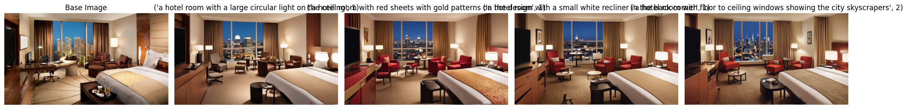
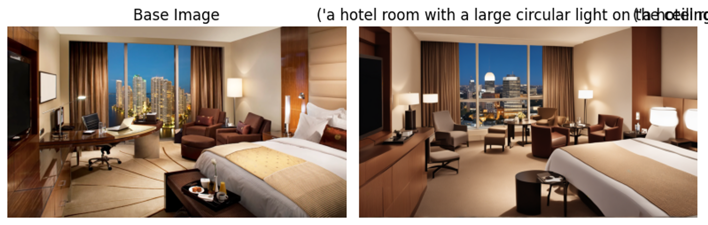
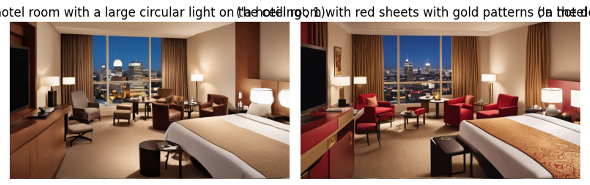
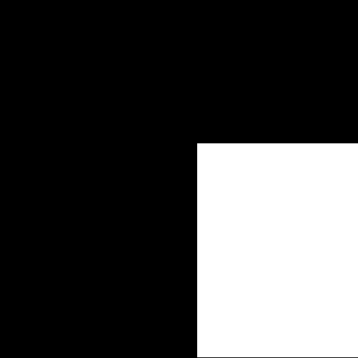
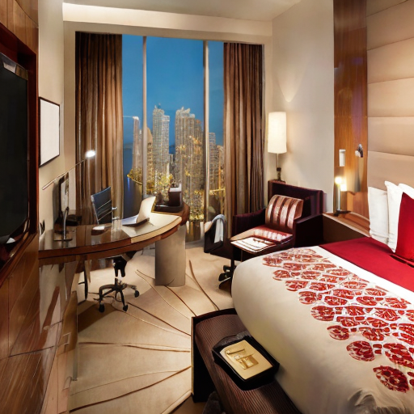
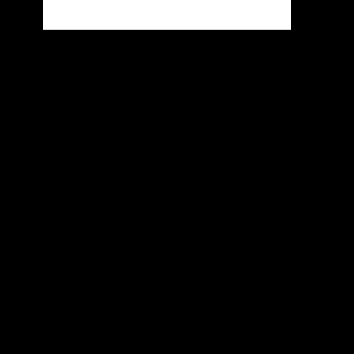
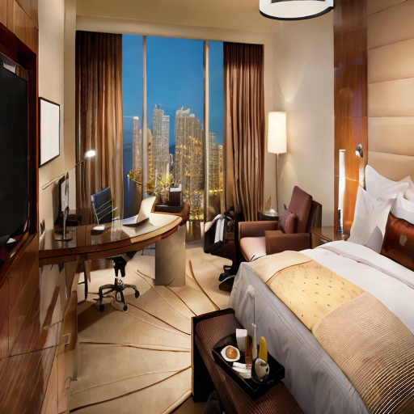
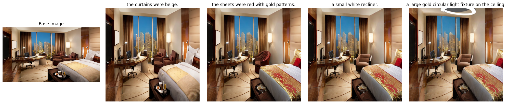

The easiest way to run this code is via this colab notebook on an A-100 or L4 since it must generate many images depending on how long the description is: https://colab.research.google.com/drive/1zsAB8jZ9uInkBw5szUDoNWtOijip7PZt?usp=sharing for v1
and
https://colab.research.google.com/drive/1dBOPvO8Fo3FYIjpgOPVaifuBb52LXf-Q?usp=sharing for v2

don't forget to add the base image hotel.png

-------------------------------------------------------------------------

## Motivation and Introduction

The motivation for this project was brought on by my work with the Traffickcam project which has a large database of crowd sourced hotel images which can be used to identify locations of human trafficking by the department of defense. The envisioned scenario is that a human trafficking victim could describe in their own words their surroundings to be recorded as text. Using the text description of the hotel room they were in and a similar base image, can AI tools such as stable diffusion be used to replace existing information of the image's setting with visual features that match the text description. This obviously requires multimodal model like CLIP in order to properly evaluate text and images in the same way. The hope and hypothesis of the project was that, if it worked, the resulting transformed image might even be able to be used to retrieve the actual hotel image from the database should it exist. If not then it at least could be a visual aid that might help identify the real location of the hotel room.

This project breaks down a long text description into edit targets and prompts, using naive backtracking to decide the order in which to make these edits. The reason for this is using naive backtracking to find the order of edits that creates the best outcome image while the image is changing dyamically. If a prompt replaces a chair with a desk and then another prompt is "the desk had flowers on it". The order in which those edits happen matter. It is often also true that color changes can affect lots of global colors meaning the order in which the edit is made will affect global color too. For all these reasons and more the user will not know the optimal order of edits to yield the best picture so this algorithm backtracks to find the best edit sequence for the final image.

## Methods

The initial method for editing the images was to use the img2img method of stable diffusion models. This technique involves starting with a base image (the original base hotel image) and adding a bit of noise to that image rather than starting from noise alone. Then during the denoising process of stable diffusion, the features of the original image will start to resemble the desired features as described in the prompt by pushing the image's CLIP embedding closer to the prompt's CLIP embedding.

Based on the text description T of the room's features, atomic edits will be generated. All of these atomic edits represent the edit space E. State St is made up of the embedding of the current image I and an ordered set of all edits completed of which each edit e ∈ E of all atomic edits.

St = (It, Et)

The action consists of the selection of a new edit to update state St. This process will either be random or based on a heuristic that can help decide what edits should be made first. After each new action a new image embedding It is generated and the list of completed edits Et.

Actions = members of E not in Et
π(e∣St) = 1 / |members of E not in Et| or π(e∣St) ∝ h(e)

No more actions are allowed for one search after all edits are completed so each run will have |E| edits to make. Edit paths will be selected using naive backtracking and since the output of each step is a new image (or the embedded information in the image embedding) it is fully observable. The state St will transition upon the action of selecting a new edit to a new picture and edit list (It, Et) using a stable diffusion model with img2img capabilities.

It+1 = f(It, et) where f represents the img2img process
Et+1 = Et + et

The base image for the img2img operation is the current image It and the text prompt et will be the selected edit, for example “the bed had blue pillows”. An observation score rt can be computed as the cosine similarity between the current image embedding and the embedding full text description T known as Te.

rt+1=cos(It+1,Te)

If the edit ever causes the cosine similarity between It and Te to go down or if the result of an edit yields low cosine similarity to the edit prompt then that branch is not working well and can therefore be pruned or backtracked in this case. Each edit should push the similarity score higher as features start matching better and better.

Prune if rt < rt-1
prune if rt < threshold

### Cleaner Images and Edits with Inpainting

The final version of this project uses inpainting and Grounding Dino in order to have more fine grained control of how the image changes. Grounding Dino allows for open set zero shot class identification. This means that a bounding box for any object in an image can be produced for any text prompt. This bounding box can be used as a mask for a stable diffusion model to use to localize image edits to a particular location. The outcome of this is that if a prompt says: "the bed sheets were red", the grounding dino model can isolate the location of the bed so that the "red" or "bed sheet" parts of the prompt do not permeate the entire image. The idea is localized edits that can still make sense in the context of the whole image which is what the inpainting model allows us to do better than just plain stable diffusion.

The complicated part of this was that in some images there would be a desired feature like a couch in the corner but there is no couch in the original image. This led to the introduction of edit prompts and edit targets. The edit prompts are the prompts to the inpainting model, the edit targets are the prompts for grounding dino in order to get a reasonable bounding box of the target. This method allowed for more minute changes since they could sometimes be localized to a very small box in the original image.

## Results

initial results were not good and a great deal of time went into optimizing the hyperparameters of the stable diffusion model. The key parameters were the denoising strength and guidance scale. The denoising strength .... and guidance scale .. These initial results eventually yielded reasonable pictures but never got the edits correct and almost always led to making the changes more globally than was desired since the edits often were localized areas of the room.

Img2Img Sequence

 

While using the img2img technique a strength level was given between 0.6 and 0.9 for each edit. This strength level influenced the how much the image would vary from the original. The intended effect of this was to show that some edits required a larger color or object change so adding more noise to the original was required. There was also an intuition that the larger the edit needed to be, the better it would be to do early since the global color changes and feature changes of the big edits could be fixed by the smaller ones so strength level became a heuristic for higher priority edits. Remaining edits were then ordered by strength level, but this did not lead to far better performance as the sequence would usually still be similar and the edit quality was still relatively poor and unfocused.

Circlular lights everywhere.

 

Red sheets everywhere.

 

### Grounding Dino

The biggest issue with the img2img technique was that features like colors or themes would permeate the entire image even when guided strictly with the text prompt. Saying "the bed had red sheets" will turn every pillow red as well as the curtains and any other texture depending on the denoising strength level. The solution required specific edits in order to properly encode the information into the image. Recent developments in the stable diffusion world have led to the creation of inpainting models that use masks to specifically target generate a new patch of an image and blend it in to the real picture seamlessly. These models are not perfect but will work far better than img2img to make specific edits to an image.

The only drawback to the inpainting method was that each individual edit required a mask to condition which pixels are in the desired region. To address this, Grounding Dino was implemented to do zero-shot object detection on the target location for each edit. Grounding Dino is a model capable of generating open-set object detection meaning that it can, theoretically, identify any vague edit target in a hotel room. Once implemented with parameters for box and score thresholds optimized it was capable of proposing reasonable bounding boxes for most edits given targets like 'ceiling' or 'the chair in the corner' or 'bed'. These masks combined with the inpainting model made more consistent and better looking edits. They also scored slightly higher for all cosine similarity metrics, but not to a significant degree.

### Metrics

The cosine similarity metrics used for each run compared the following: original image to atomic edit description embeddings, final edited image to atomic edit description embeddings, and a proxy for what the real described hotel room would be to the atomic edit description embeddings. The inpainting generally had higher similarities for the final edited picture. The metric used to decide to backtrack on the quality of an edit was cosine similarity to that edited image and the individual edit embedding.

Cosine similarity between the final edited image and the retrieval proxy image were generally high around 0.7 to 0.8 but highest with inpainting method with around 0.9. This however is not as impressive as they all still have about 0.8-0.9 cosine similarity with the original hotel image as well so this metric may not be the most accurate way to measure the edit task.

## Conclusion

The goal of the experiment was to try to break down text data and encode it into an image for the sake of making an image that better represents the target location, but might even be used as a means to retrieve an image of the target location from a dataset of images. Though the results are very interesting and very capable of delivering specific edits to pictures systematically and unsupervised, the quality of the resulting embeddings is not such that it can be used for retrieval as many hotel rooms will score very highly with one another. Instead there is more hope in focusing on the embeddings of the atomic edits. The atomic edits can be decomposed into a list of features that should be in that image. They may not all have high cosine similarity scores but comparing the average of individual features with an image seems more effective than generating a new image for direct image to image retrieval. That of course has its own limitation of how high can the cosine similarity to all the features be if each feature is pulling the embedding in some direction. Perhaps a picture is not worth a thousand words when their embeddings have the same dimensionality.

Inpainting Sequence
